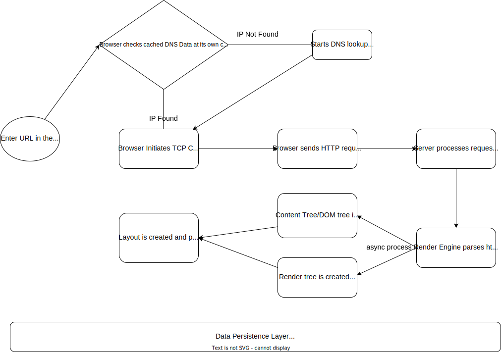

# Browser

- The main functionality of a browser to represent the resources we choose by requesting it from server. The resources can be html, video, pdf, image or anything which server sends.

- To process this response from server and to represent it to us browser uses below high level components

  - The user interface - every part of the browser except the requested page window

  - The browser engine - communicates actions between the ui and rendering engine

  - The rendering engine - responsible for displaying requested content

  - Networking - for Network calls such as HTTP request

  - Javascript Interpreter - To parse and execute Js code

  - Data storage - To store data locally such as cookies

# What happens when we enter a URL in the browser ?

- When you point your browser at a URL, your brower has to figure out which server on the internet is hosting the site

  - Browser looks up IP address for the domain

  - Browser initiates TCp connection with the server

  - Browser sends the HTTP request to the server

  - Server processes the request and send back a response

  - After that rendering engine comes to play

    - The rendering engine will start parsing the HTML document and convert elements to DOM nodes in a tree called "DOM tree"

    - After parsing both external css files and in-line style elements , rendering engine will take that information combine with visual instructions from Html to give it to the browser so that it can create the "Render Tree"

    - This is a async process

    - The render tree will be traversed and each node will be painted using the UI backend layer

    - The HTML parser and Css Parser will prvide a parse tree

    - The parse tree is a tree is a tree of DOM element and atrribute nodes. DOM is Document Object Model i.e the object representation of the HTML document and interface of HTML elements for the Javascript

    - The render tree is the visual representation of the document , that is consist of visual elements in the order they will be displayed which enables painting of the contents in their correct order.

    - When the renderer is created and added to the tree , it does not have a position and size , calcuating those values is called LAYOUT or REFLOW

    - In the painting stage , the renderern is traversed and renderer's paint() method is called to display content on the screen

    - it uses the Ui infrastructure component

    - The parsing of the document halts untill the script has been executed . If the script is external then the resource must first fetched from the network

    - This is by default done synchronously , unless 'defer' attribut is added to the script, in which case it will not halt the document parsing and will execute after the document is parsed

